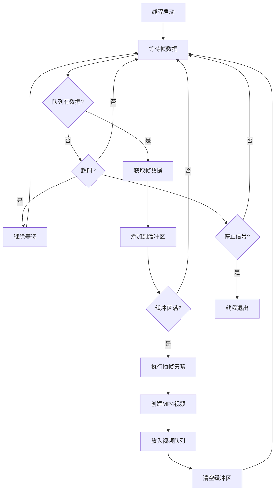
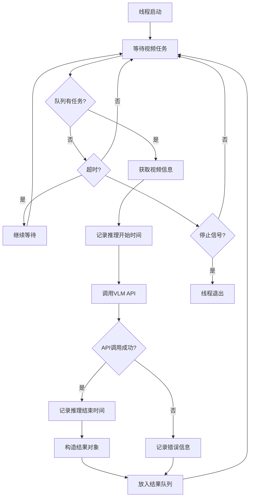
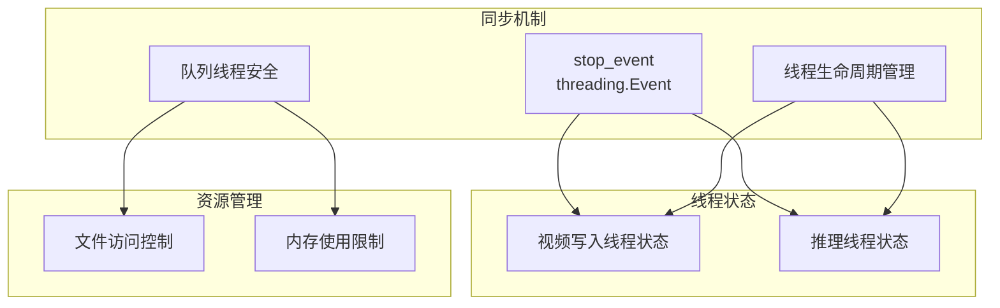

# AsyncVideoProcessor 内部架构详解

## 概述

`AsyncVideoProcessor` 是整个VLM监控系统的核心组件，实现了真正的异步视频处理。它通过多线程架构和队列系统，实现了帧接收、视频生成和VLM推理的并行处理。

## 内部架构图

```mermaid
graph TB
    subgraph "AsyncVideoProcessor 内部架构"
        subgraph "主线程接口"
            API[公共API接口]
            ADD_FRAME[add_frame()]
            GET_RESULT[get_result()]
            START[start()]
            STOP[stop()]
        end
        
        subgraph "线程池"
            VWT[视频写入线程<br/>_video_writer_worker]
            IT[推理线程<br/>_inference_worker]
        end
        
        subgraph "队列系统"
            FQ[帧队列<br/>frame_queue<br/>maxsize=100]
            VQ[视频队列<br/>video_queue<br/>maxsize=10]
            RQ[结果队列<br/>result_queue<br/>maxsize=20]
        end
        
        subgraph "缓冲区"
            FB[帧缓冲区<br/>frame_buffer<br/>List[FrameData]]
        end
        
        subgraph "外部组件"
            VLM[DashScopeVLMClient]
            FS[文件系统<br/>临时MP4文件]
        end
        
        subgraph "控制机制"
            SE[停止事件<br/>stop_event]
            STATS[统计信息<br/>计数器和时间戳]
        end
    end
    
    %% 数据流
    ADD_FRAME --> FQ
    FQ --> VWT
    VWT --> FB
    FB --> VWT
    VWT --> FS
    VWT --> VQ
    VQ --> IT
    IT --> VLM
    VLM --> IT
    IT --> RQ
    RQ --> GET_RESULT
    
    %% 控制流
    START --> VWT
    START --> IT
    STOP --> SE
    SE --> VWT
    SE --> IT
    
    %% 监控流
    VWT --> STATS
    IT --> STATS
    
    %% 样式
    classDef apiNode fill:#e3f2fd
    classDef threadNode fill:#fce4ec
    classDef queueNode fill:#f1f8e9
    classDef bufferNode fill:#fff3e0
    classDef externalNode fill:#e8eaf6
    classDef controlNode fill:#f3e5f5
    
    class API,ADD_FRAME,GET_RESULT,START,STOP apiNode
    class VWT,IT threadNode
    class FQ,VQ,RQ queueNode
    class FB bufferNode
    class VLM,FS externalNode
    class SE,STATS controlNode
```

## 线程详细说明

### 1. 视频写入线程 (_video_writer_worker)

**职责**:
- 从帧队列接收帧数据
- 实现智能抽帧策略
- 生成MP4视频文件
- 将视频信息传递给推理线程

**工作流程**:


**抽帧策略实现**:
```python
def _sample_frames_by_time(self, frames):
    """基于时间的抽帧策略"""
    if not frames:
        return []
    
    # 计算时间跨度
    start_time = frames[0]['relative_timestamp']
    end_time = frames[-1]['relative_timestamp']
    time_span = end_time - start_time
    
    # 计算抽帧间隔
    interval = time_span / self.target_frames_per_video
    
    sampled_frames = []
    for i in range(self.target_frames_per_video):
        target_time = start_time + i * interval
        # 找到最接近目标时间的帧
        closest_frame = min(frames, 
                          key=lambda f: abs(f['relative_timestamp'] - target_time))
        sampled_frames.append(closest_frame)
    
    return sampled_frames
```

### 2. 推理线程 (_inference_worker)

**职责**:
- 从视频队列获取待处理视频
- 调用DashScope VLM API
- 记录推理时间和元数据
- 将结果放入结果队列

**工作流程**:


## 队列系统详解

### 队列配置

| 队列名称 | 最大大小 | 数据类型 | 用途 |
|----------|----------|----------|------|
| frame_queue | 100 | FrameData | 存储从RTSP接收的原始帧 |
| video_queue | 10 | VideoInfo | 存储待推理的视频信息 |
| result_queue | 20 | ResultData | 存储VLM推理结果 |

### 数据结构

```python
# 帧数据结构
FrameData = {
    'frame': np.ndarray,           # 帧图像数据
    'timestamp': float,            # 绝对时间戳
    'relative_timestamp': float,   # 相对时间戳
    'frame_number': int           # 帧序号
}

# 视频信息结构
VideoInfo = {
    'video_path': str,            # MP4文件路径
    'frame_count': int,           # 帧数
    'created_at': float,          # 创建时间
    'start_relative_timestamp': float,  # 开始时间戳
    'end_relative_timestamp': float,    # 结束时间戳
    'original_frame_range': List[int],  # 原始帧范围
    'sampling_info': Dict         # 抽帧信息
}

# 结果数据结构
ResultData = {
    'result': str,                # VLM分析结果
    'video_path': str,            # 视频文件路径
    'video_info': VideoInfo,      # 视频信息
    'inference_start_time': float,     # 推理开始时间
    'inference_end_time': float,       # 推理结束时间
    'inference_duration': float,       # 推理耗时
    'inference_start_timestamp': str,  # 推理开始时间戳
    'inference_end_timestamp': str,    # 推理结束时间戳
    'error': Optional[str]        # 错误信息
}
```

## 并发控制机制

### 线程同步



### 错误处理

1. **队列满处理**: 
   - 帧队列满时丢弃新帧
   - 视频队列满时阻塞等待
   - 结果队列满时覆盖旧结果

2. **API调用失败**:
   - 记录错误信息
   - 继续处理下一个任务
   - 不中断整个流程

3. **文件系统错误**:
   - 自动重试机制
   - 临时目录清理
   - 磁盘空间检查

## 性能优化策略

### 内存优化

```python
# 队列大小动态调整
def adjust_queue_sizes(self, memory_usage):
    if memory_usage > 0.8:  # 内存使用超过80%
        self.frame_queue.maxsize = min(50, self.frame_queue.maxsize)
        self.video_queue.maxsize = min(5, self.video_queue.maxsize)
    elif memory_usage < 0.5:  # 内存使用低于50%
        self.frame_queue.maxsize = min(200, self.frame_queue.maxsize * 2)
        self.video_queue.maxsize = min(20, self.video_queue.maxsize * 2)
```

### CPU优化

```python
# 线程优先级设置
def set_thread_priority(self):
    # 推理线程优先级较高
    os.nice(-5)  # 提高推理线程优先级
    
    # 视频写入线程优先级较低
    os.nice(5)   # 降低写入线程优先级
```

### I/O优化

```python
# 异步文件操作
async def write_video_async(self, frames, output_path):
    loop = asyncio.get_event_loop()
    with concurrent.futures.ThreadPoolExecutor() as executor:
        await loop.run_in_executor(executor, self._write_video_sync, frames, output_path)
```

## 监控和调试

### 性能指标

```python
class PerformanceMetrics:
    def __init__(self):
        self.frames_processed = 0
        self.videos_created = 0
        self.inferences_completed = 0
        self.average_inference_time = 0.0
        self.queue_sizes = {}
        self.memory_usage = 0.0
        self.cpu_usage = 0.0
```

### 日志记录

```python
# 详细的操作日志
logger.info(f"视频写入线程: 收集到 {len(self.frame_buffer)} 帧")
logger.info(f"抽帧策略: 从 {total_frames} 帧中抽取 {sampled_count} 帧")
logger.info(f"视频创建: {video_path}, 大小: {file_size}MB")
logger.info(f"推理开始: {video_name}, 队列大小: {self.video_queue.qsize()}")
logger.info(f"推理完成: 耗时 {duration:.2f}s, 结果长度: {len(result)}")
```

### 调试工具

```python
def dump_state(self):
    """导出当前状态用于调试"""
    return {
        'frame_queue_size': self.frame_queue.qsize(),
        'video_queue_size': self.video_queue.qsize(),
        'result_queue_size': self.result_queue.qsize(),
        'frame_buffer_size': len(self.frame_buffer),
        'threads_alive': {
            'video_writer': self.video_writer_thread.is_alive(),
            'inference': self.inference_thread.is_alive()
        },
        'stop_event_set': self.stop_event.is_set(),
        'statistics': self.get_statistics()
    }
```

## 扩展点

### 自定义抽帧策略

```python
class CustomSamplingStrategy:
    def sample_frames(self, frames, target_count):
        """自定义抽帧逻辑"""
        pass

# 注册自定义策略
processor.set_sampling_strategy(CustomSamplingStrategy())
```

### 多VLM模型支持

```python
class MultiModelProcessor(AsyncVideoProcessor):
    def __init__(self, vlm_clients):
        self.vlm_clients = vlm_clients
        
    def _inference_worker(self):
        # 轮询使用不同的VLM模型
        pass
```

### 结果后处理

```python
class ResultPostProcessor:
    def process_result(self, result):
        """对VLM结果进行后处理"""
        # 文本清理、格式化、分析等
        pass

# 注册后处理器
processor.set_result_processor(ResultPostProcessor())
``` 