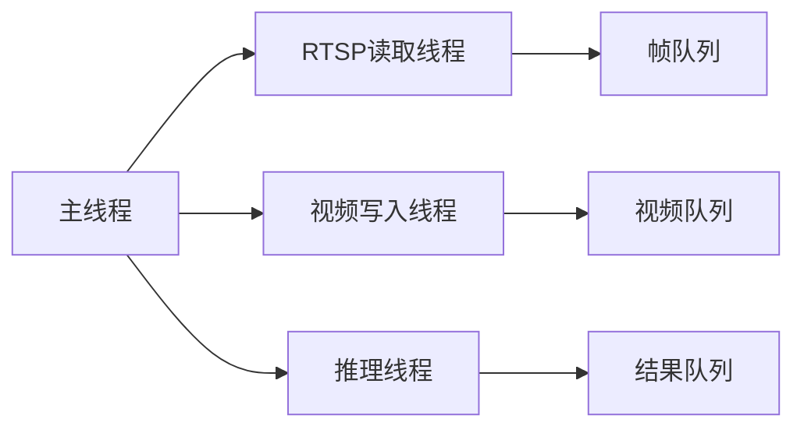

# VLM监控系统文档

本目录包含VLM监控系统的完整技术文档，涵盖系统架构、组件设计、测试报告等内容。

## 📚 文档目录

### 🏗️ 架构设计

- **[SYSTEM_ARCHITECTURE.md](./SYSTEM_ARCHITECTURE.md)** - 系统整体架构
  - 完整的系统架构图（Mermaid）
  - 各层组件详细说明
  - 线程架构和数据流
  - 异步处理流程
  - 性能指标和配置参数

- **[ASYNC_PROCESSOR_ARCHITECTURE.md](./ASYNC_PROCESSOR_ARCHITECTURE.md)** - 异步处理器内部架构
  - AsyncVideoProcessor核心组件详解
  - 多线程架构和队列系统
  - 并发控制和错误处理
  - 性能优化策略
  - 监控和调试工具

### 📋 设计文档

- **[RTSP_VLM_Integration_Design.md](./RTSP_VLM_Integration_Design.md)** - RTSP和VLM集成设计
  - 集成方案设计
  - 接口定义
  - 数据流设计

### 📊 技术报告

- **[FRAME_SAMPLING_REPORT.md](./FRAME_SAMPLING_REPORT.md)** - 帧抽样策略报告
  - 智能抽帧算法
  - 性能分析
  - 优化建议

- **[SETUP_PROBLEM_ANALYSIS_REPORT.md](./SETUP_PROBLEM_ANALYSIS_REPORT.md)** - 环境配置问题分析
  - 常见问题及解决方案
  - 环境配置指南
  - 故障排除

## 🎯 快速导航

### 新手入门
1. 先阅读 [SYSTEM_ARCHITECTURE.md](./SYSTEM_ARCHITECTURE.md) 了解整体架构
2. 查看 [ASYNC_PROCESSOR_ARCHITECTURE.md](./ASYNC_PROCESSOR_ARCHITECTURE.md) 理解核心组件
3. 参考 [SETUP_PROBLEM_ANALYSIS_REPORT.md](./SETUP_PROBLEM_ANALYSIS_REPORT.md) 配置环境

### 开发者
1. 研究 [RTSP_VLM_Integration_Design.md](./RTSP_VLM_Integration_Design.md) 了解集成方案
2. 参考 [FRAME_SAMPLING_REPORT.md](./FRAME_SAMPLING_REPORT.md) 优化抽帧策略
3. 使用架构图进行系统扩展

### 运维人员
1. 关注 [SYSTEM_ARCHITECTURE.md](./SYSTEM_ARCHITECTURE.md) 中的性能指标
2. 参考 [ASYNC_PROCESSOR_ARCHITECTURE.md](./ASYNC_PROCESSOR_ARCHITECTURE.md) 中的监控工具
3. 查看 [SETUP_PROBLEM_ANALYSIS_REPORT.md](./SETUP_PROBLEM_ANALYSIS_REPORT.md) 解决问题

## 🔧 系统概览

### 核心特性
- ✅ **异步处理**: 真正的多线程异步架构
- ✅ **智能抽帧**: 基于时间的抽帧策略
- ✅ **流水线处理**: 帧接收、视频生成、VLM推理并行
- ✅ **自动重连**: RTSP连接断开自动恢复
- ✅ **详细日志**: 完整的操作时间线记录
- ✅ **实验管理**: 自动组织测试数据和结果

### 技术栈
- **视频处理**: OpenCV, FFmpeg
- **RTSP协议**: 自研客户端和服务器
- **VLM推理**: 阿里云DashScope API
- **并发控制**: Python threading, queue
- **数据格式**: MP4视频, JSON结果

### 性能指标
- **推理延迟**: 45-60秒/视频
- **并行效率**: 接近100%
- **吞吐量**: 每3秒生成一个视频片段
- **内存控制**: 多级队列缓冲

## 📈 架构亮点

### 1. 分层架构
```
测试控制层 → 异步处理层 → VLM推理层
     ↓           ↓           ↓
帧接收层 → 流传输层 → 数据源层
```

### 2. 异步流水线
```
RTSP帧接收 → 帧缓冲 → 视频生成 → VLM推理 → 结果输出
    ↓           ↓         ↓         ↓         ↓
  实时进行    智能抽帧   并行处理   异步推理   结构化存储
```

### 3. 多线程协作


## 🚀 使用示例

### 基本测试
```bash
# 运行完整集成测试
python tests/test_rtsp_vlm_simple.py YOUR_API_KEY

# 指定参数
python tests/test_rtsp_vlm_simple.py YOUR_API_KEY \
    --video data/test.avi \
    --n-frames 30 \
    --port 8554
```

### 查看结果
```bash
# 实验数据目录
ls tmp/experiment_YYYYMMDD_HHMMSS/

# 测试结果
cat tmp/experiment_YYYYMMDD_HHMMSS/test_results.json

# N帧测试详情
cat tmp/experiment_YYYYMMDD_HHMMSS/n_frames_30/summary.json
```

## 🔍 故障排除

### 常见问题
1. **RTSP连接失败** → 检查FFmpeg安装和端口占用
2. **VLM推理超时** → 检查API密钥和网络连接
3. **内存不足** → 调整队列大小参数
4. **文件权限错误** → 检查临时目录权限

### 调试工具
```python
# 查看处理器状态
processor.dump_state()

# 获取性能指标
processor.get_statistics()

# 查看队列状态
print(f"帧队列: {processor.frame_queue.qsize()}")
print(f"视频队列: {processor.video_queue.qsize()}")
print(f"结果队列: {processor.result_queue.qsize()}")
```

## 📝 更新日志

- **v1.0** - 基础RTSP和VLM集成
- **v1.1** - 添加异步处理器
- **v1.2** - 智能抽帧策略
- **v1.3** - 详细日志和监控
- **v1.4** - 完整架构文档

## 🤝 贡献指南

1. 阅读相关架构文档
2. 遵循现有代码风格
3. 添加必要的测试用例
4. 更新相关文档

## 📞 联系方式

如有问题或建议，请通过以下方式联系：
- 提交Issue
- 发起Pull Request
- 查看文档获取更多信息 