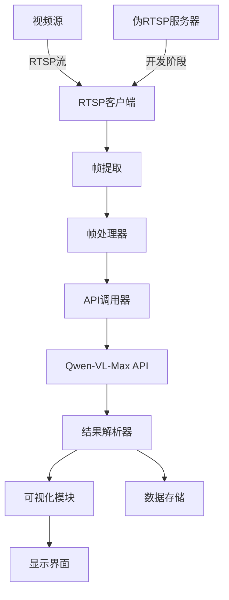

# RTSP视频流与Qwen-VL-Max集成设计方案

## 系统架构


## 模块说明

### 1. 伪RTSP服务器（开发阶段）
- 使用FFmpeg创建本地RTSP流
- 示例命令：
  ```bash
  ffmpeg -re -i input.mp4 -c copy -f rtsp rtsp://localhost:8554/stream
  ```

### 2. RTSP客户端
- OpenCV VideoCapture读取视频流
- 配置参数：
  - 帧率控制
  - 连接重试逻辑
  - 超时设置

### 3. 帧处理器
- 图像预处理：
  - 尺寸调整
  - 格式转换
  - base64编码
- 请求体构造：
  ```json
  {
    "image": "base64编码图像",
    "task": "object_detection",
    "params": {
      "confidence_threshold": 0.7
    }
  }
  ```

### 4. API调用器
- 异步请求实现
- 错误处理：
  - 重试机制
  - 限流控制
- 认证：
  - API Key验证

### 5. 结果解析器
- 处理返回JSON：
  ```json
  {
    "objects": [
      {
        "label": "person",
        "confidence": 0.92,
        "bbox": [x1,y1,x2,y2]
      }
    ]
  }
  ```
- 非极大值抑制(NMS)处理

### 6. 可视化模块
- OpenCV绘制功能：
  - Bbox绘制
  - 标签标注
  - 置信度显示
- 可选PyQt界面

## 开发步骤
1. 实现伪RTSP服务器测试环境
2. 开发RTSP客户端基础功能
3. 集成Qwen-VL-Max API调用
4. 实现结果解析和可视化
5. 优化性能和处理流程
6. 测试和调试