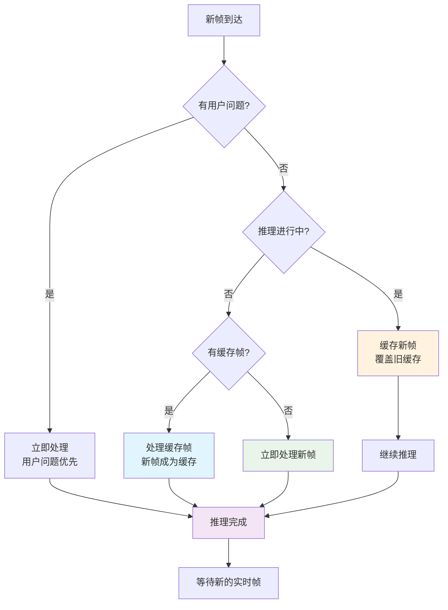

# 同步推理模式 (Sync Inference Mode)

## 概述

同步推理模式是对原有异步推理系统的重要升级，旨在解决高并发推理导致的服务限流和延迟问题。在同步模式下，系统会等待当前推理完成后再处理下一帧，从而避免推理服务过载。

## 问题背景

### 原有问题
- **并发过载**: 每一帧都会触发推理，导致并发量过大
- **服务限流**: 推理服务限流导致严重延迟（如30秒延迟）
- **资源浪费**: 大量推理任务排队等待，消耗系统资源

### 🆕 时序竞争问题（已修复）
在初始实现中存在一个严重的时序竞争问题：
- **问题描述**: 推理完成时，系统会将缓存的第N帧加入队列，但此时最新实时帧可能已经是第N+t帧
- **竞争条件**: `current_inference_active = False` 和处理缓存帧之间存在时间窗口
- **结果**: 导致第N帧和第N+t帧同时进入推理，破坏同步模式
- **修复方案**: 改进帧缓存逻辑，确保只处理最新的实时帧

### 解决方案
- **同步推理**: 等待当前推理完成再处理下一帧
- **帧缓存机制**: 推理进行中的新帧会被缓存，只保留最新帧
- **用户问题优先**: 用户问题具有最高优先级，可抢占推理
- **🆕 实时帧优先**: 推理完成后优先处理最新的实时帧，而非过时的缓存帧

## 核心功能

### 1. 同步推理控制

```python
# 启用同步推理模式
processor.set_sync_inference_mode(True)

# 检查当前模式
is_sync = processor.get_sync_inference_mode()
```

### 2. 推理状态管理

系统维护以下推理状态：
- `current_inference_active`: 当前是否有推理在进行
- `current_inference_details`: 当前推理的详细信息
- `pending_frame_data`: 待处理的最新帧数据

### 3. 帧处理逻辑



**关键改进**:
- 🔧 **修复时序竞争**: 推理完成后不再调用独立的缓存帧处理方法
- 🎯 **实时帧优先**: 推理空闲时优先检查缓存帧，确保处理最新帧
- ⚡ **原子操作**: 缓存帧检查和处理在同一个锁保护下进行

### 4. 用户问题优先级

- **最高优先级**: 用户问题可以抢占当前推理流程
- **原子性分配**: 确保每个用户问题只被一个推理任务处理
- **自动释放**: 推理完成后自动释放用户问题

## 配置选项

### config.json 配置

```json
{
  "vlm": {
    "sync_inference_mode": true,
    "max_concurrent_inferences": 1,
    "comment": "sync_inference_mode控制推理模式：true为同步模式，false为异步模式"
  }
}
```

### 配置参数说明

| 参数 | 类型 | 默认值 | 说明 |
|------|------|--------|------|
| `sync_inference_mode` | boolean | `true` | 是否启用同步推理模式 |
| `max_concurrent_inferences` | integer | `1000` | 最大并发推理数（同步模式建议设为1） |

## API 接口

### 设置推理模式

```python
# 启用同步模式
processor.set_sync_inference_mode(True)

# 启用异步模式
processor.set_sync_inference_mode(False)
```

### 获取推理状态

```python
status = processor.get_inference_status()
print(status)
```

返回的状态信息：
```json
{
  "sync_mode": true,
  "inference_active": false,
  "active_tasks": 0,
  "max_concurrent": 1,
  "total_started": 10,
  "total_completed": 10,
  "frames_skipped_sync": 5,
  "user_questions_processed": 2,
  "has_pending_frame": false,
  "current_inference": {
    "media_path": "/path/to/image.jpg",
    "media_type": "image",
    "frame_number": 123,
    "duration": 2.5
  }
}
```

## 性能优化

### 1. 减少推理延迟

**同步模式前**:
- 第i秒的图像 → 30秒后响应（限流导致）
- 大量推理任务排队

**同步模式后**:
- 第i秒的图像 → 3秒内响应
- 单个推理任务，无排队

### 2. 资源利用优化

- **内存使用**: 减少大量排队任务的内存占用
- **网络带宽**: 避免同时发送大量推理请求
- **服务器负载**: 推理服务器负载更加平稳

### 3. 统计信息

系统提供详细的统计信息：
- `frames_skipped_sync_mode`: 同步模式下跳过的帧数
- `user_questions_processed`: 处理的用户问题数
- `last_inference_completion_time`: 上次推理完成时间

## 使用场景

### 1. 实时监控场景

适用于需要实时响应但可以容忍跳帧的场景：
- 安防监控
- 智能哨兵
- 异常检测

### 2. 用户交互场景

适用于需要快速响应用户问题的场景：
- 语音问答
- 实时查询
- 交互式监控

### 3. 资源受限场景

适用于推理服务资源有限的场景：
- 边缘计算设备
- 共享推理服务
- 成本敏感应用

## 测试验证

### 运行测试

```bash
# 运行同步推理模式测试
python tools/test_sync_inference_mode.py
```

### 测试内容

1. **基本同步推理**: 验证推理的同步执行
2. **帧跳过逻辑**: 验证推理进行中的帧缓存
3. **推理状态监控**: 验证状态信息的准确性
4. **模式切换**: 验证同步/异步模式的动态切换

### 预期结果

- 同步模式下推理按顺序执行
- 推理进行中的帧被正确缓存
- 用户问题得到优先处理
- 模式切换正常工作

## 最佳实践

### 1. 配置建议

```json
{
  "vlm": {
    "sync_inference_mode": true,
    "max_concurrent_inferences": 1
  },
  "video_processing": {
    "target_video_duration": 1.0,
    "frames_per_second": 1,
    "target_frames_per_video": 1
  }
}
```

### 2. 监控建议

- 定期检查 `get_inference_status()` 获取系统状态
- 监控 `frames_skipped_sync_mode` 了解跳帧情况
- 关注 `user_questions_processed` 确保用户问题得到处理

### 3. 性能调优

- 根据推理服务性能调整帧率
- 监控推理延迟，必要时切换到异步模式
- 平衡实时性和准确性需求

## 故障排除

### 常见问题

1. **推理卡住**: 检查推理服务是否正常
2. **帧丢失过多**: 考虑降低帧率或优化推理性能
3. **用户问题无响应**: 检查ASR服务和问题管理器状态

### 调试方法

```python
# 获取详细状态
status = processor.get_inference_status()
logger.info(f"推理状态: {status}")

# 检查用户问题管理器
if processor.question_manager:
    question_info = processor.question_manager.get_question_info()
    logger.info(f"问题状态: {question_info}")
```

## 未来扩展

### 1. 自适应模式

根据推理服务负载自动切换同步/异步模式

### 2. 优先级队列

支持多级优先级的帧处理队列

### 3. 负载均衡

支持多个推理服务的负载均衡

## 总结

同步推理模式通过最小的架构改动，有效解决了高并发推理导致的性能问题。该模式特别适合实时监控和用户交互场景，能够显著提升系统的响应速度和用户体验。 