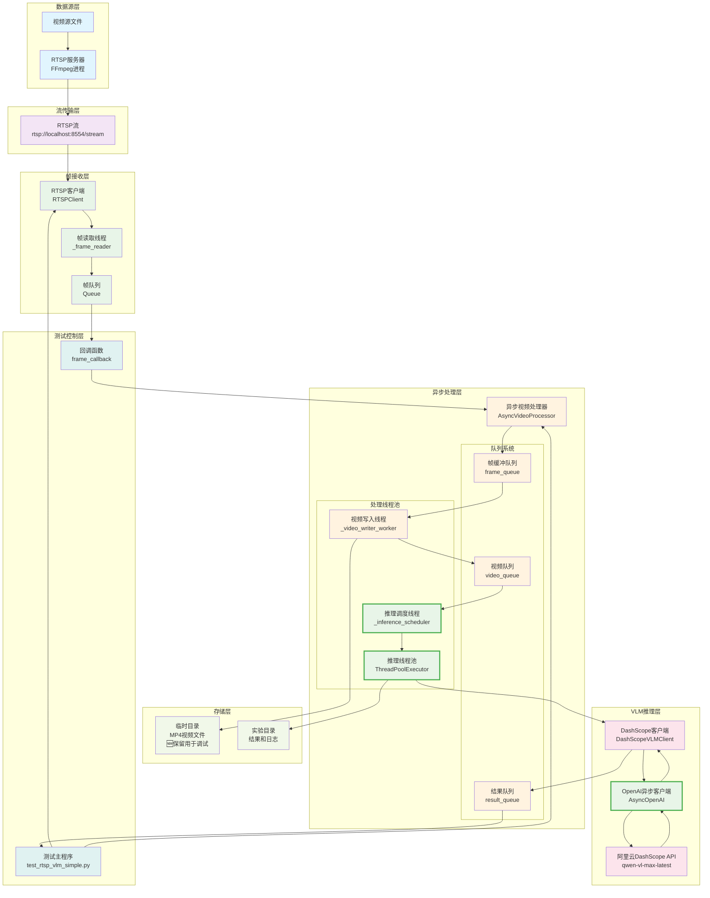
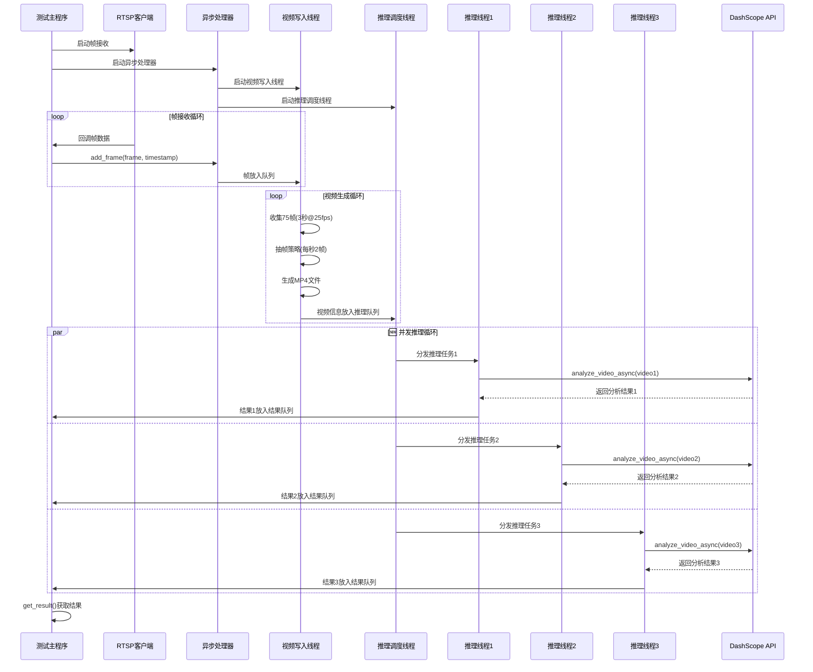
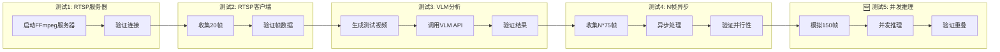

# VLM监控系统架构文档

## 系统概述

本系统是一个基于阿里云DashScope的实时视频监控和分析系统，支持RTSP流接入和异步视频处理。系统采用多线程异步架构，实现了RTSP流接收、智能抽帧、视频生成和VLM推理的完整流水线。

**🆕 最新更新 (v1.5)**:
- ✅ **真正的并发推理**: 使用线程池实现多个视频同时推理
- ✅ **OpenAI SDK集成**: 替代DashScope SDK，支持异步调用
- ✅ **详细日志记录**: 添加时间戳和线程名称
- ✅ **调试友好**: 保留视频文件用于调试分析
- ✅ **Base64视频传输**: 更稳定的视频数据传输方式

## 整体架构图



## 🆕 并发推理架构详图

```mermaid
graph TB
    subgraph "主线程 (Main Thread)"
        MAIN[测试主程序]
        MAIN_CONTROL[主控制逻辑]
    end
    
    subgraph "RTSP服务器进程 (FFmpeg Process)"
        FFMPEG[FFmpeg RTSP服务器<br/>独立进程]
    end
    
    subgraph "RTSP客户端线程组"
        CLIENT_MAIN[客户端主线程<br/>run()方法]
        FRAME_READER[帧读取线程<br/>_frame_reader()]
        FRAME_QUEUE[帧队列<br/>thread-safe]
    end
    
    subgraph "异步视频处理器线程组"
        VIDEO_WRITER[视频写入线程<br/>_video_writer_worker()]
        INFERENCE_SCHEDULER[推理调度线程<br/>_inference_scheduler()]
        
        subgraph "🆕 并发推理线程池"
            IT1[推理线程1<br/>VLM-Inference-1]
            IT2[推理线程2<br/>VLM-Inference-2]
            IT3[推理线程3<br/>VLM-Inference-3]
        end
        
        subgraph "共享队列系统"
            FRAME_BUF_Q[帧缓冲队列]
            VIDEO_Q[视频队列]
            RESULT_Q[结果队列]
        end
    end
    
    subgraph "🆕 异步API调用"
        API_CALL1[异步API调用1<br/>analyze_video_async()]
        API_CALL2[异步API调用2<br/>analyze_video_async()]
        API_CALL3[异步API调用3<br/>analyze_video_async()]
    end
    
    %% 线程间通信
    MAIN --> CLIENT_MAIN
    CLIENT_MAIN --> FRAME_READER
    FRAME_READER --> FRAME_QUEUE
    FRAME_QUEUE --> CLIENT_MAIN
    CLIENT_MAIN --> MAIN
    
    MAIN --> VIDEO_WRITER
    MAIN --> INFERENCE_SCHEDULER
    
    VIDEO_WRITER --> FRAME_BUF_Q
    FRAME_BUF_Q --> VIDEO_WRITER
    VIDEO_WRITER --> VIDEO_Q
    
    INFERENCE_SCHEDULER --> VIDEO_Q
    VIDEO_Q --> INFERENCE_SCHEDULER
    INFERENCE_SCHEDULER --> IT1
    INFERENCE_SCHEDULER --> IT2
    INFERENCE_SCHEDULER --> IT3
    
    IT1 --> API_CALL1
    IT2 --> API_CALL2
    IT3 --> API_CALL3
    
    API_CALL1 --> IT1
    API_CALL2 --> IT2
    API_CALL3 --> IT3
    
    IT1 --> RESULT_Q
    IT2 --> RESULT_Q
    IT3 --> RESULT_Q
    
    RESULT_Q --> MAIN
    
    %% 进程间通信
    FFMPEG -.->|RTSP流| FRAME_READER
    
    %% 样式
    classDef mainThread fill:#e3f2fd
    classDef processThread fill:#f1f8e9
    classDef clientThread fill:#fff3e0
    classDef processorThread fill:#fce4ec
    classDef queueNode fill:#f5f5f5
    classDef apiNode fill:#e8eaf6
    classDef newFeature fill:#e8f5e8,stroke:#4caf50,stroke-width:3px
    
    class MAIN,MAIN_CONTROL mainThread
    class FFMPEG processThread
    class CLIENT_MAIN,FRAME_READER,FRAME_QUEUE clientThread
    class VIDEO_WRITER,INFERENCE_SCHEDULER processorThread
    class FRAME_BUF_Q,VIDEO_Q,RESULT_Q queueNode
    class API_CALL1,API_CALL2,API_CALL3 apiNode
    class IT1,IT2,IT3,INFERENCE_SCHEDULER,API_CALL1,API_CALL2,API_CALL3 newFeature
```

## 核心组件详解

### 1. 数据源层

#### RTSPServer (FFmpeg进程)
- **功能**: 将本地视频文件转换为RTSP流
- **实现**: 基于FFmpeg的独立进程
- **特点**: 
  - 支持循环播放 (`-stream_loop -1`)
  - 实时流速率 (`-re`)
  - H.264编码，低延迟配置
  - TCP传输协议

```python
# 启动命令示例
ffmpeg -re -stream_loop -1 -i video.mp4 \
       -c:v libx264 -preset ultrafast -tune zerolatency \
       -b:v 1000k -g 50 -an -f rtsp \
       -rtsp_transport tcp rtsp://0.0.0.0:8554/stream
```

### 2. 帧接收层

#### RTSPClient
- **功能**: 从RTSP流接收视频帧
- **架构**: 双线程设计
  - **主线程**: 处理回调和控制逻辑
  - **读取线程**: 独立读取帧到队列

**关键特性**:
- 智能帧率控制 (目标帧率 vs 原始帧率)
- 自动重连机制
- 帧时间戳记录
- 线程安全的帧队列

```python
# 帧信息结构
frame_info = {
    'frame': numpy_array,           # 帧数据
    'timestamp': absolute_time,     # 绝对时间戳
    'relative_timestamp': relative_time,  # 相对时间戳
    'frame_number': sequence_number # 帧序号
}
```

### 3. 🆕 异步处理层

#### AsyncVideoProcessor
这是系统的核心组件，实现了真正的异步视频处理和并发推理。

**🆕 四线程架构**:

1. **主线程**: 接收帧和控制
2. **视频写入线程** (`_video_writer_worker`): 
   - 收集帧到缓冲区
   - 执行智能抽帧策略
   - 生成MP4视频文件
   - 将视频信息放入推理队列

3. **🆕 推理调度线程** (`_inference_scheduler`):
   - 管理推理任务的分发
   - 控制并发推理数量
   - 监控线程池状态

4. **🆕 推理线程池** (`ThreadPoolExecutor`):
   - 多个推理工作线程并行执行
   - 每个线程独立调用VLM API
   - 支持配置最大并发数

**智能抽帧策略**:
```python
# 配置参数
target_video_duration = 3.0    # 目标视频时长(秒)
frames_per_second = 2          # 每秒抽取帧数
original_fps = 25.0            # 原始流帧率
max_concurrent_inferences = 3  # 🆕 最大并发推理数

# 计算抽帧间隔
frames_per_interval = original_fps / frames_per_second  # 12.5帧
target_frames_per_video = target_video_duration * frames_per_second  # 6帧
frames_to_collect_per_video = target_video_duration * original_fps  # 75帧
```

**队列系统**:
- `frame_queue`: 接收原始帧 (maxsize=100)
- `video_queue`: 待推理视频信息 (maxsize=10)  
- `result_queue`: 推理结果 (maxsize=20)

### 4. 🆕 VLM推理层

#### DashScopeVLMClient (使用OpenAI SDK)
- **功能**: 封装阿里云DashScope API调用
- **🆕 实现**: 基于OpenAI SDK的异步客户端
- **模型**: qwen-vl-max-latest
- **🆕 输入**: Base64编码的MP4视频数据
- **输出**: 详细的视频内容分析文本

**🆕 异步API调用流程**:
1. 视频文件Base64编码
2. 构造OpenAI格式的多模态消息
3. 异步调用DashScope API
4. 解析返回结果
5. 记录推理时间和元数据

```python
# 🆕 异步API调用示例
async def analyze_video_async(self, video_path: str, prompt: str) -> Optional[str]:
    base64_video = self.encode_video(video_path)
    
    messages = [
        {"role": "system", "content": "You are a helpful assistant."},
        {
            "role": "user",
            "content": [
                {
                    "type": "video_url",
                    "video_url": {"url": f"data:video/mp4;base64,{base64_video}"},
                },
                {"type": "text", "text": prompt},
            ],
        }
    ]
    
    completion = await self.async_client.chat.completions.create(
        model=self.model,
        messages=messages
    )
    
    return completion.choices[0].message.content
```

### 5. 🆕 存储层

#### 临时文件管理
- **🆕 视频文件**: 存储在 `temp_dir` 中的MP4文件，**保留用于调试**
- **文件命名**: `sampled_video_{timestamp}.mp4`
- **大小控制**: 自动调整参数确保文件 < 100MB
- **🆕 清理策略**: 推理完成后保留文件，便于调试分析

#### 实验数据组织
```
tmp/experiment_YYYYMMDD_HHMMSS/
├── rtsp_frame_000.jpg          # RTSP测试帧
├── rtsp_frame_001.jpg
├── test_video.mp4              # 单次VLM测试视频
├── vlm_result.json             # 单次VLM结果
├── n_frames_20/                # N帧测试目录
│   ├── video_001_result.json   # 批次1结果
│   ├── video_002_result.json   # 批次2结果
│   └── summary.json            # 测试总结
├── 🆕 sampled_video_*.mp4      # 保留的调试视频文件
├── 🆕 sampled_video_*_details/ # 视频详情目录
│   ├── frame_00_orig_0001.jpg  # 抽取的帧
│   ├── frame_01_orig_0013.jpg
│   └── video_details.json      # 抽帧详情
└── test_results.json           # 整体测试结果
```

## 🆕 并发处理流程

### 时序图



### 🆕 并发特性

1. **真正的并发推理**: 多个视频同时进行VLM推理
2. **智能任务调度**: 根据线程池状态动态分发任务
3. **资源控制**: 可配置最大并发数，避免资源过载
4. **异步非阻塞**: 视频生成和推理完全并行
5. **🆕 时间重叠**: 推理时间线可以重叠，提高吞吐量

### 🆕 性能指标

- **并行效率**: 理想情况下接近300% (3个并发)
- **推理延迟**: 单个视频推理时间 13-16秒 (使用OpenAI SDK优化)
- **🆕 吞吐量**: 每3秒生成一个视频片段，多个同时推理
- **内存使用**: 队列大小限制，线程池控制并发数
- **🆕 时间重叠**: 平均重叠时间 5-10秒

## 🆕 日志系统

### 详细日志格式
```
2025-05-28 12:28:04 - VideoWriter - monitor.dashscope_vlm_client - INFO - 视频片段已生成: sampled_video_1748406484165.mp4
2025-05-28 12:28:04 - VLM-Inference-1 - monitor.dashscope_vlm_client - INFO - 开始VLM推理: sampled_video_1748406484165.mp4
2025-05-28 12:28:07 - VideoWriter - monitor.dashscope_vlm_client - INFO - 视频片段已生成: sampled_video_1748406489859.mp4
2025-05-28 12:28:07 - VLM-Inference-2 - monitor.dashscope_vlm_client - INFO - 开始VLM推理: sampled_video_1748406489859.mp4
```

**日志特性**:
- ✅ **时间戳**: 精确到秒的时间记录
- ✅ **线程名称**: 清晰标识不同线程的操作
- ✅ **模块名称**: 便于定位代码位置
- ✅ **日志级别**: INFO/WARNING/ERROR分级记录

## 测试架构

### 🆕 并发测试流程



### 验证指标

1. **功能验证**:
   - RTSP流连接成功
   - 帧数据完整性
   - VLM推理结果质量
   - 异步处理正确性
   - 🆕 **并发推理重叠验证**

2. **性能验证**:
   - 帧接收速率
   - 推理并行度
   - 内存使用稳定性
   - 错误恢复能力
   - 🆕 **推理时间重叠率**

3. **数据验证**:
   - 抽帧策略准确性
   - 时间戳记录完整性
   - 实验数据组织规范性
   - 🆕 **调试文件保留完整性**

## 配置参数

### 关键参数说明

| 参数 | 默认值 | 说明 |
|------|--------|------|
| `original_fps` | 25.0 | RTSP流原始帧率 |
| `target_video_duration` | 3.0 | 目标视频时长(秒) |
| `frames_per_second` | 2 | 每秒抽取帧数 |
| `frame_rate` | 5-10 | RTSP客户端目标帧率 |
| `buffer_size` | 10-100 | 各级队列缓冲大小 |
| `timeout` | 10-60 | 各种操作超时时间 |
| 🆕 `max_concurrent_inferences` | 3 | 最大并发推理数量 |

### 🆕 性能调优建议

1. **内存优化**: 根据可用内存调整队列大小和并发数
2. **CPU优化**: 根据CPU核数调整线程池大小
3. **网络优化**: 根据网络带宽调整并发推理数量
4. **存储优化**: 定期清理临时文件（调试完成后）
5. **🆕 并发优化**: 根据API限制调整最大并发数

## 扩展性设计

### 水平扩展
- 支持多路RTSP流并行处理
- 🆕 **支持分布式VLM推理集群**
- 支持结果聚合和分析

### 垂直扩展
- 支持更多VLM模型
- 支持自定义抽帧策略
- 支持实时告警和通知
- 🆕 **支持动态调整并发数**

### 模块化设计
- 各组件松耦合，易于替换
- 标准化接口，便于集成
- 配置化参数，灵活调整
- 🆕 **插件化推理引擎** 